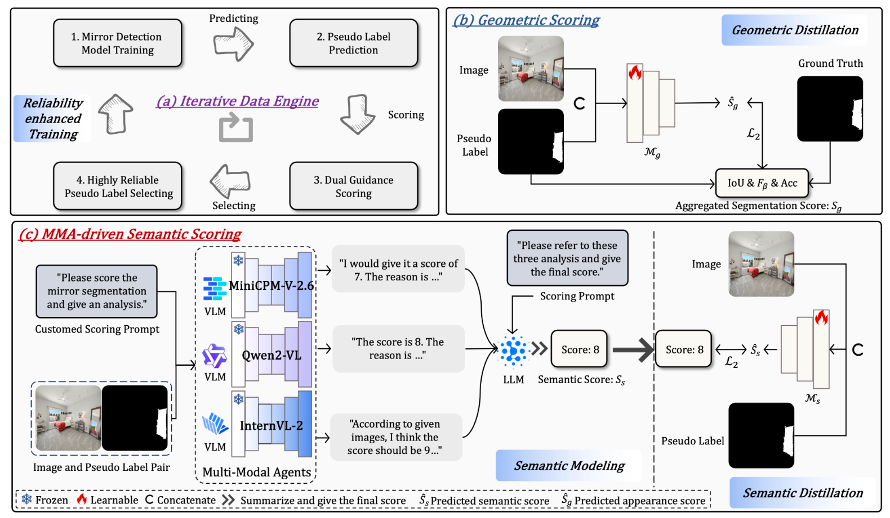

# Detect Any Mirrors: Boosting Learning Reliability on Large-Scale Unlabeled Data with an Iterative Data Engine

> **Accepted at CVPR 2025**

---




## Overview

This project introduces a robust method for detecting mirrors across diverse real-world scenes, leveraging large-scale unlabeled data with an iterative data engine.

---

## Dataset

You can download the dataset here:  
👉 [Download Dataset](https://hkustgz-my.sharepoint.com/:f:/g/personal/zxing565_connect_hkust-gz_edu_cn/EsR9RHaFxhdBjRGs18JjZmoBUxxu5yUZSjFolVyhBT6_-g?e=VkOWGG)

- **Content**:  
  - 220,000 images from various scenarios involving mirrors.
  - Corresponding pseudo labels.

---

## Model

The pre-trained model is available at the same link:  
👉 [Download Pre-trained Model](https://hkustgz-my.sharepoint.com/:f:/g/personal/zxing565_connect_hkust-gz_edu_cn/EsR9RHaFxhdBjRGs18JjZmoBUxxu5yUZSjFolVyhBT6_-g?e=VkOWGG)

- After downloading, **place the model weights inside the `weight/` directory**.

---

## Inference

To perform inference with the pre-trained model, simply run:

```bash
python inference.py